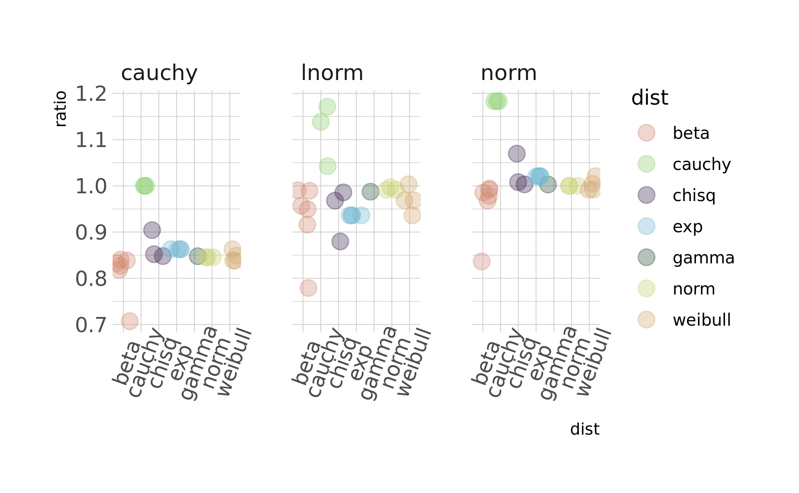

```{r setup, include=FALSE}
knitr::opts_chunk$set(echo = FALSE)
```


Dear Curiosity Science friends,

Thanks for asking me to write a letter about why I love my job in mathematical science. I went to the Curiousity Science website to be inspired by the awesome letters posted there and found myself thinking, gosh, I certainly feel like no one's [role model](https://curiositygirlsscience.wordpress.com/rolemodels/). 

I'm currently doing a doctorate in statistical metaresearch, and role model status notwithstanding, I think I have the best job in the world.

I spend the vast bulk of my time learning statistical computing, thinking about how mathematical algorithms are interpreted, and how we really can make science easier while making it better. And indeed, I feel we must. 
 

<blockquote class="twitter-tweet" data-lang="en"><p lang="en" dir="ltr"><a href="https://twitter.com/hashtag/credrev18?src=hash&amp;ref_src=twsrc%5Etfw">#credrev18</a> <a href="https://twitter.com/cantabile?ref_src=twsrc%5Etfw">@cantabile</a> bridging the tool chain gap and reminding us on important truths. And spiderman. <a href="https://t.co/lmNvQFAwrf">pic.twitter.com/lmNvQFAwrf</a></p>&mdash; Fiona Fidler (@fidlerfm) <a href="https://twitter.com/fidlerfm/status/1062540488002088961?ref_src=twsrc%5Etfw">November 14, 2018</a></blockquote>
<script async src="https://platform.twitter.com/widgets.js" charset="utf-8"></script>


We are living through a data revolution; we can draw powerful conclusons we couldn't before. Making sure we get these methods of drawing conclusions right seems useful; I feel like I'm learning to do something that's really useful in science, and that's exciting.

In the last year, I have been delighted to travel the world consulting with researchers with this shared interest in how we can science as best we can, and how we can help others do the same. 

In addition to feeling genuinely connected with why what I do is important, I find the work itself really relaxing and fun. 

I spend my time programming or doing mathematics, but I'm always working toward making a picture with the data, like this one from last week.



Making pictures with my data is my favourite. When the picture aligns with what I think the mathematics is telling me it should look like, I feel like I'm clocking a level on a video game. 

<iframe src="https://giphy.com/embed/3o6EhD8Soj2RCzU448" width="480" height="270" frameBorder="0" class="giphy-embed" allowFullScreen></iframe><p><a href="https://giphy.com/gifs/video-game-overwatch-3o6EhD8Soj2RCzU448">via GIPHY</a></p>

Now, you might be thinking, so why would you say you're _not_ a role model? This all sounds pretty impressive. 

Well, here's the thing. I did **everything** wrong.

I dropped out of high school three times, yup, count 'em.

I also first became a musician. I feel like I make use of the skills I developed as a musician in my practice of mathematical science every day. Musicians work alone, they think creatively, they solve problems, they have many skills, such as reading music, theory, and so forth. In many ways music is a lot like mathematical science. 

I didn't start taking an interest in data and mathematics until I was thirty. I was tired of odd jobs and freelancing, and life wasn't getting in the way so much anymore. So I thought I'd skill up in something that we were meant to have a shortage of. I never dreamt I would do so much with this.   

<iframe width="560" height="315" src="https://www.youtube.com/embed/o0Rqz8Hgacc" frameborder="0" allow="accelerometer; autoplay; encrypted-media; gyroscope; picture-in-picture" allowfullscreen></iframe>

Erin asked what advice I have to give. 

First, if anyone is a role model, it's [Erin](https://curiositygirlsscience.wordpress.com/about/). She is someone who looks at a crappy situation, like how girls are often discouraged from science, and say, what can I do about it? These people are my role models. 

And for some reason a whole lot of people have felt compelled to tell me that I'm not smart enough to this over the years. Here's what I think, the thing that matters is how much you _enjoy_ learning about something; not what you already know. If you enjoy learning mathematics or programming, there is a whole world of fun problems to solve out there with those skills.

Best,
Charles

