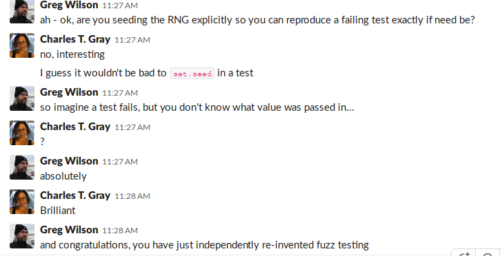

```{r setup, include=FALSE}
knitr::opts_chunk$set(echo = TRUE, message = FALSE)
```


Came across this neat testing concept recently, _fuzz testing_. 

I was working through some primers on testing,  I got to thinking about [equivalence class partitioning](https://en.wikipedia.org/wiki/Equivalence_class) in algebra (I had a proof on equivalence class partitions in my thesis) as a means of exploring the question, for what values of `<type>` does my function `<fn>` run? 

Anyway, I got to thinking it may well not entirely be clear to another user what assumptions were made. And these things can **matter**. For me, it's often the difference between whether my code runs or not. 

## randomising testing inputs

I'd been experimenting with randomly sampling testing parameters, trying to cover my bases, as it were. But I didn't feel clear on how to go about it until I was working through these primers recently. 

Realising the partitions will make explicit my assumptions is really handy. Especially for future Charles. Past Charles has a way of assuming that future Charles will intuit what was the obvious thing to check. 

## testing numerics

Take for example a `numeric` argument `<arg>` for a function `<fn>`. I've been tripped up many a time by negative numbers going into a `log`. So I might make sure I test a **positive** number, a **negative** number, and 0.   

test | equivalence class | `<arg> = `
- | - | - 
positive | $[-\infty, 0)$ | `runif(1, -100, 0)`
0 |  $[0,0]$ |  0
negative | $(0, \infty]$ |  `runif(1, 0, 100)`

## can we use $\infty$ as an argument in `runif`?

No.

```{r inf no good, eval=FALSE}
> runif(1)
[1] 0.567648
> runif(1, -inf)
Error in runif(1, -inf) : object 'inf' not found
> inf
Error: object 'inf' not found
> Inf
[1] Inf
> runif(1, -Inf)
[1] NaN
Warning message:
In runif(1, -Inf) : NAs produced
```

So, we need to choose an arbitrarily large number. Say, 100. 

Indeed, what about small numbers, particularly those between 0 and 1? 

And, what about $\pm 1$? It _is_ always a special case because of cancelling effects. Could cause me trouble. 

## updated partitions

test | equivalence class | `<arg> = `
- | - | - 
negative | $[-\infty, 0)$ | `runif(1, -100, -1)`
-1 |  $[-1,-1]$ |  -1
small negative | $(-1, 0)$ | `runif(1, -1, 0)`
0 |  $[0,0]$ |  0
small positive | $(0, 1)$ | `runif(1, 0, 1)`
1 |  $[1,1]$ |  1 
positive | $(1, \infty]$ |  `runif(1, 1, 100)`

## meh, stop somewhere

But what if 100 is not large enough? What if `<fn>(<arg>)` is fine if `<arg>` < 100, but fails if `<arg>` = 150? (The things that keep us up at night.) Meh, at some point you need to call it. For these analyses, I don't think I'll worry about that for now. I think going as big as 100 should cover my bases. 

So what I like about this is my tests make it clear what contingences I've prepared for, and what I haven't. 

## others types are easier

Finally, the good news is that other types are easier to partition. Logicals have only `TRUE` and `FALSE` inputs. 

## fuzz testing

I pestered the author of the primers I was working through, Greg Wilson, with these thoughts, and he put me onto this concept of [fuzz testing](https://en.wikipedia.org/wiki/Fuzzing). 

## update: reproducibility

Something I forgot to mention in this post, that came up in discussion when I posted this to twitter was reproducibility. How to ensure another can reproduce my results, and, in particular, my errors. Especially when I need help. And I always need help.

<blockquote class="twitter-tweet" data-lang="en"><p lang="en" dir="ltr">If you&#39;re using random numbers though, how do you know what value caused a failure? So you set the seed in each test file, maybe by date?</p>&mdash; Heather Turner (@HeathrTurnr) <a href="https://twitter.com/HeathrTurnr/status/1092338359182258176?ref_src=twsrc%5Etfw">February 4, 2019</a></blockquote>
<script async src="https://platform.twitter.com/widgets.js" charset="utf-8"></script>

```{r eval=FALSE}
# include this at the top of your testing script for reproducibility
set.seed(<pick a number>)
```



## a question

Heather Turner raised a question, that I myself also wondered about.

<blockquote class="twitter-tweet" data-lang="en"><p lang="en" dir="ltr">Takes away the randomness though, which might be useful here. Something related to current date/time may be better as long as the expected result is still predictable.</p>&mdash; Heather Turner (@HeathrTurnr) <a href="https://twitter.com/HeathrTurnr/status/1092345228495912960?ref_src=twsrc%5Etfw">February 4, 2019</a></blockquote>
<script async src="https://platform.twitter.com/widgets.js" charset="utf-8"></script>

My current solution is to remove `set.seed` at the moment, while I'm playing around with the functions, but to use `set.seed` when I'm collaborating. And intend to set it for publication, but that's a fair more testing aways as of yet. 

I'm curious whether people, especially with development training, have insight? 