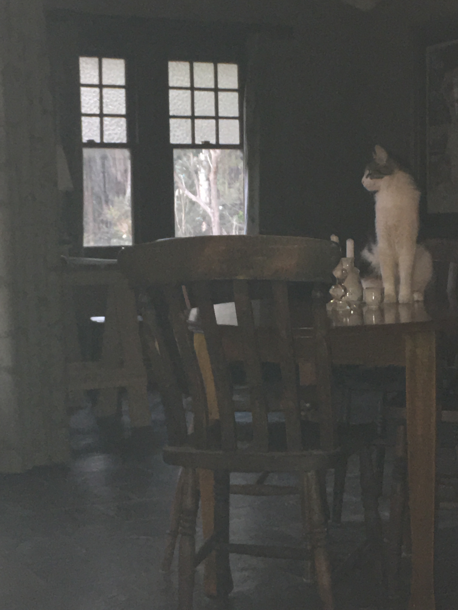
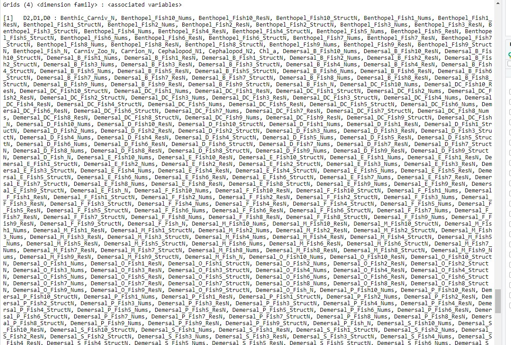

```{r setup, include=FALSE}
options(htmltools.dir.version = FALSE)
```




---
# She's the cats' mother


---

class: bottom, right

background-image: url(https://upload.wikimedia.org/wikipedia/commons/3/30/Euklid-von-Alexandria_1.jpg)

Image credit: [Wikimedia Commons](https://commons.wikimedia.org/wiki/File:Sharingan_triple.svg)


---


class: bottom, right
background-size: cover
background-image: url(https://upload.wikimedia.org/wikipedia/commons/8/8a/CICB%27s_Laboratory.jpg)

Image credit: [Wikimedia Commons](https://commons.wikimedia.org/w/index.php?curid=21915714)

---
class: middle, right

```{r echo=FALSE}

```

Image credit: [Mike Penguin]()

---
class: top, right

background-image: url(https://upload.wikimedia.org/wikipedia/en/2/21/Web_of_Spider-Man_Vol_1_129-1.png)

Image credit: [Wikimedia Commons](https://en.wikipedia.org/w/index.php?curid=58461384)

# with great power comes great responsibility

---
class: bottom, right

background-image: url(http://unconf18.ropensci.org/images/Seattle.svg)

Image credit: [rOpenSci](http://unconf18.ropensci.org/)

# bridging the toolchain gap

---
class: middle, centre

# `varameta`

For meta-analysing medians.


---
class: middle

# open and reproducible data analysis

## open research culture (Nosek, 2015)

## _opinionated_ data analysis (Parker, 2017)

### _good enough_ (Bryan, 2018) scientific computing vs _best practices_ (Wilson, 2014)
### software dev, packaged data analysis (Marwick, 2018)
### ethical data management
### accessibility: code & results - _refactoring_ (Bryan @ useR! 2018)

---

# what do _you_ think is **good enough** data management?

## in what ways are you **opinionated** about data analysis?

### what are your favourite tools?


- working group discussion
- write up our comments: website/chapter
- [`radix`](https://rstudio.github.io/radix/) for example, my blog, [`measured.`](http://cantabile.rbind.io/blog.html)

---
# this is happening _fast_

<blockquote class="twitter-tweet" data-lang="en"><p lang="en" dir="ltr">To accompany the paper, we have the rrtools pkg <a href="https://t.co/JOwkoeT8TR">https://t.co/JOwkoeT8TR</a> &amp; some presentations, such as <a href="https://t.co/S4DnZmChGB">https://t.co/S4DnZmChGB</a> <a href="https://t.co/FrpiTuJI5n">pic.twitter.com/FrpiTuJI5n</a></p>&mdash; Ben Marwick (@benmarwick) <a href="https://twitter.com/benmarwick/status/1066218210142220288?ref_src=twsrc%5Etfw">November 24, 2018</a></blockquote>
<script async src="https://platform.twitter.com/widgets.js" charset="utf-8"></script>


---
# References

Marwick, Ben, Carl Boettiger, and Lincoln Mullen. “Packaging Data Analytical Work Reproducibly Using R (and Friends).” The American Statistician 72, no. 1 (January 2, 2018): 80–88. https://doi.org/10.1080/00031305.2017.1375986.

Nosek, B. A., G. Alter, G. C. Banks, D. Borsboom, S. D. Bowman, S. J. Breckler, S. Buck, et al. “Promoting an Open Research Culture.” Science 348, no. 6242 (June 26, 2015): 1422–25. https://doi.org/10.1126/science.aab2374.

Parker, Hilary. “Opinionated Analysis Development,” 2017. https://doi.org/10.7287/peerj.preprints.3210v1.

Wilson, Greg, D. A. Aruliah, C. Titus Brown, Neil P. Chue Hong, Matt Davis, Richard T. Guy, Steven H. D. Haddock, et al. “Best Practices for Scientific Computing.” Edited by Jonathan A. Eisen. PLoS Biology 12, no. 1 (January 7, 2014): e1001745. https://doi.org/10.1371/journal.pbio.1001745.

Wilson, Greg, Jennifer Bryan, Karen Cranston, Justin Kitzes, Lex Nederbragt, and Tracy K. Teal. “Good Enough Practices in Scientific Computing.” Edited by Francis Ouellette. PLOS Computational Biology 13, no. 6 (June 22, 2017): e1005510. https://doi.org/10.1371/journal.pcbi.1005510.

---
## these slides were made in R

#### slides
Slides are listed in the [talks]() on my blog, `measured.` [cantabile.rbind.io](http://cantabile.rbind.io/), created in [`radix::`](https://rstudio.github.io/radix/) (September 2018) for web-based scientific communication.

#### source 
Code for these slides found [here](https://github.com/softloud/measured/blob/master/talks/replication/marseille-2018.Rmd): https://github.com/softloud/measured/blob/master/talks/replication/marseille-2018.Rmd

---
class: inverse
#### Thanks for listening! How to bling your slides, r-ladies style: 

```{r eval=FALSE, echo = TRUE}
output:
  xaringan::moo?n_reader:
    css: ["default", "rladies", "rladies-fonts"]
```

```{r echo = TRUE}
knitr::include_url("https://alison.rbind.io/post/r-ladies-slides/", height = 375)
``` 
